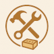
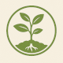
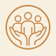
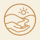
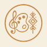
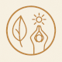

## What You Gain by Participating

**Benefits Across the Eight Permaculture Capitals**

Metachrysalis is designed to nourish *people*, not just projects. Participation supports you across multiple forms of wealth recognizing that real regenerative work draws strength from many sources at once.
 
---

### **Material Capital**

*Tools, infrastructure, and tangible support.*

* Access to **platforms, templates, and digital infrastructure** (Discord, documentation tools, community systems)
* Logistical and promotional support for March projects
* Exposure to **local tools, spaces, and material resources** through peer connection

---

### **Natural Capital**

*Deepened relationship with place.*

* Guided exploration of the **Fraser Lowland as a living system**—not just a backdrop
* Projects grounded in **local land, watersheds, ecosystems, and climate realities**
* Increased ecological literacy through peer learning and systems mapping
* Opportunities to align your work with **restoration, resilience, and care for the more-than-human world**

---

### **Social Capital**

*Trust, relationships, and mutual support.*

* Entry into a **carefully held community of emergent leaders and changemakers**
* Meaningful connections with collaborators, mentors, judges, and allies
* Practice in **cooperation, sociocratic decision-making, and shared governance**
* Belonging to both a regional network that continues beyond the pilot, and a small but growing global community using Metachrysalis to support their work.

> *You don’t have to carry the work alone.*

---

### **Intellectual Capital**

*Ways of thinking that scale wisdom, not burnout.*

* Exposure to **systems thinking, metacrisis analysis, and bioregional frameworks**
* Learning through shared sensemaking, pattern recognition, and peer review
* Tools for mapping complexity without flattening nuance
* Expanded language for describing your work in ways others can understand and support

---

### **Experiential Capital**

*Learning by doing, together.*

* Hands-on practice designing and delivering **real-world “moves”**
* Experience working in **time-bound, supported project cycles**
* Skills in facilitation, collaboration, documentation, and reflection
* Lived understanding of what *actually works* in your local context

> *Knowledge that lives in the body, not just the head.*

---

### **Cultural Capital**

*Stories, symbols, and shared meaning.*

* Participation in a **gameful, narrative-rich approach** to change-making
* Contribution to emerging **regional stories of regeneration and resilience**
* Shared rituals of reflection, celebration, and storytelling
* Strengthening of values rooted in care, reciprocity, and creativity

---

### **Spiritual Capital**

*Why you’re doing this work at all.*

* Space to reconnect with **purpose, meaning, and inner alignment**
* Opportunities for reflection, awe, grief, and hope—held in community
* Recognition of changemaking as **a path of becoming**, not just producing
* Support for showing up as a whole human, not a role or résumé

---

### **Financial Capital**

*Resources to act, not just ideas.*

* Access to **$2,500 in direct project funding** for selected participants, delivered transparently via Ethereum
* Experience working with **emergent funding models** tied to values, trust, and community accountability
* Increased visibility that can unlock **future funding, partnerships, or paid opportunities**
* Practical understanding of how capital can flow in regenerative, place-based ways

> *Not charity. Not extraction. Capital as nourishment.*

---

## A Different Kind of Value

Metachrysalis is not just about outcomes—it’s about **capacity**.

By participating, you end up with:

* Stronger roots in place
* Deeper trust in community
* Clearer purpose
* More ways to act, adapt, and care

This is wealth that compounds.

---
