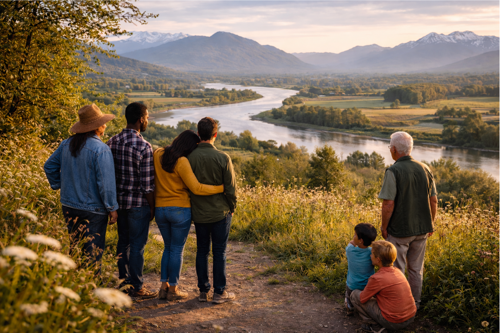
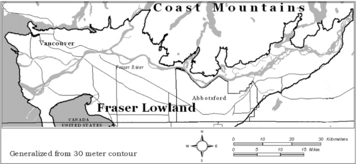

## Building Community Across the Fraser Lowland

Something is stirring across the Fraser Lowland - from Hope through Greater Vancouver to Bellingham. People are growing food, restoring ecosystems, creating gathering spaces, teaching skills, and weaving networks of care. Often quietly, often without much support, always with intention.

What if these efforts could see each other? What if the people doing this work could learn together, support each other, and discover what becomes possible when we're not working alone?

**Localism is a three-month pilot bringing together people who are already making change in the Fraser Lowland**. This is not: a startup accelerator, a pitch contest, a leaderboard, a hustle-culture productivity engine. It's an experiment in what happens when we prioritize relationships and learning alongside action - when we build community, not just react to crisis.

## Get Involved

There are two ways to participate:

### Nominate Someone

Know someone doing meaningful community work? Someone who might not think of themselves as a "leader" but shows up consistently with care and integrity?

Your nomination can open doors for people already making a difference.

<a href="https://docs.google.com/forms/d/e/1FAIpQLSfynUm56nDRB5nyriZ7Avktso_YlgXh-0ttFxZC2C8UYJJihw/viewform?usp=dialog" target="_blank">**Nominate Someone →**</a>   

### Apply Yourself

Already doing work to strengthen your community? Interested in connecting with others across the region who share your commitment to long-term change?

We'd love to hear from you.

<a href="https://docs.google.com/forms/d/e/1FAIpQLSfynUm56nDRB5nyriZ7Avktso_YlgXh-0ttFxZC2C8UYJJihw/viewform?usp=dialog" target="_blank">**Apply to participate →**</a>   

You can nominate one or more people AND apply yourself - both doors are open. 

Not sure which path is right? Learn more:

- [About this project →](/pages/about)
- [What participants gain →](/pages/benefits)
- [Who's involved →](/pages/stewards) <!--Add Admin and Mentors soon -->
- [Questions we Hear →](/pages/faq)
