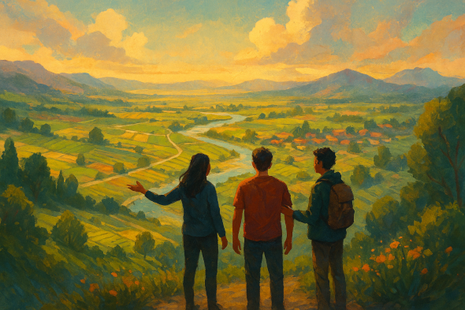
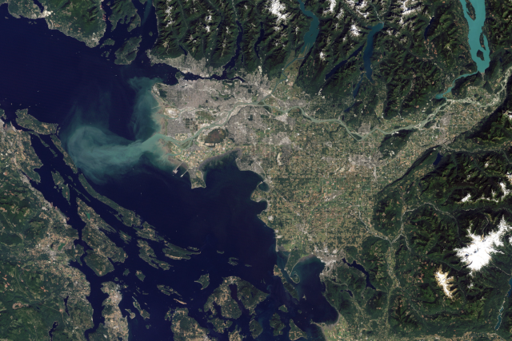

# Metachrysalis Changemaker Community
## Growing the Fraser Lowland from the inside out

Across the Fraser Lowland, people are quietly doing work that matters.

They’re building mutual aid networks, restoring ecosystems, mentoring youth, creating spaces of belonging, experimenting with new ways of solving old problems. Often without funding. Often without recognition. Almost always without institutional backing.

**Metachrysalis** exists to build community among these changemakers and local leaders—to help them find each other, learn together, and strengthen the fabric of this place. Together we'll build a network of support that includes but goes beyond financial support. Those joining the Metachrysalis community will have chances to meet and collaborate with changemakers from other regions around the world.

This is a **bioregional, community-powered initiative** rooted in the Fraser Lowland, designed to support emergent leadership and seed practical projects that help our region thrive.

### What makes this different?
- **Bioregional focus** — informed by the work of the *Design School for Regenerating Earth* and *Regenerate Cascadia*, we focus on our local region, defined both ecologically and culturally by the people who live there.

- **Metacrisis-informed** — the most pressing challenges currently facing humanity are deeply interconnected parts of a whole. Our approach spans work across ecological, social, technological, and governance challenges.

- **Gameful by design** — The Metachrysalis framework uses game design principles to help us work effectively with complexity, focus on what's important to us as individuals and a region, and to make collaboration and community building both fun and effective. 

- **Community-first** — connection comes before competition, and while some will receive funding, all will have opportunities to build support, community, momentum and growth of their work. We center human relationship and a non-transactional, non-extractive connection.

# The Fraser Lowland
## Where we live, and why it matters

Ask a child to draw a boundary around the main region on this image and they'll easily pick out the Fraser Lowland. 

The Fraser Lowland is the low-lying, fertile region stretching from the Fraser River delta through the Lower Mainland. It is shaped by water, wetlands, forests, and mountains — and by thousands of years of Indigenous stewardship, followed by waves of settlement, industry, and migration.

It is one of the most ecologically rich and culturally diverse regions in North America. It is also a place under pressure: rapid growth, ecological strain, housing precarity, climate risk, and widening social divides all converge here.

This is the **region** we call home, part of the **Cascadia Bioregion**

---

**Changemaker nominations and applications are now open.**

- → <a href="https://docs.google.com/forms/d/e/1FAIpQLSfynUm56nDRB5nyriZ7Avktso_YlgXh-0ttFxZC2C8UYJJihw/viewform?usp=dialog" target="_blank">Apply or nominate a changemaker</a>   
- → Learn about the eight domains and meet the judges (Coming Soon)
- → [Learn more about Metachrysalis](/pages/metachrysalis) 