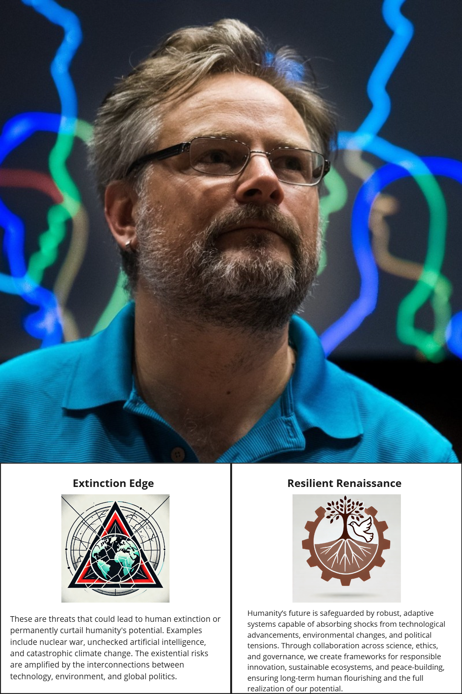
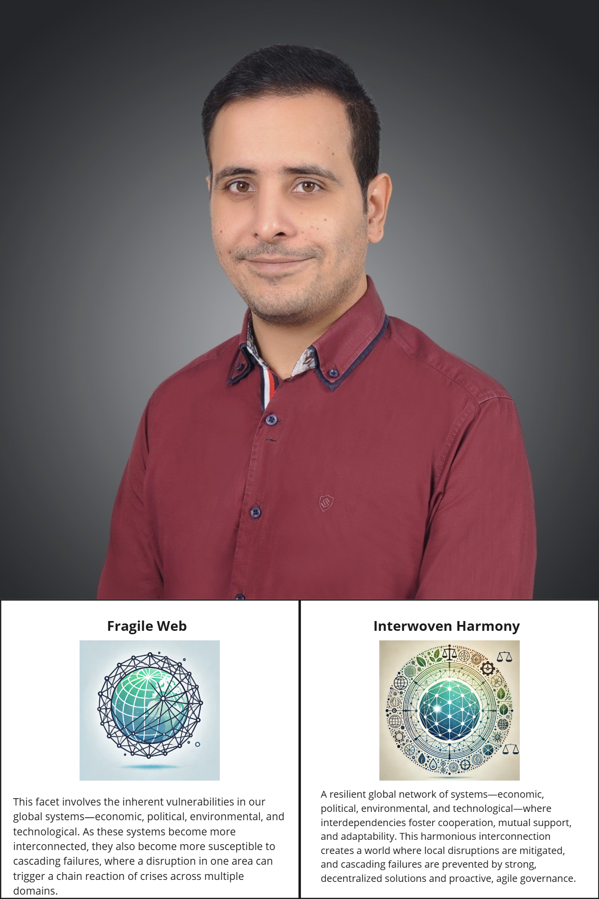
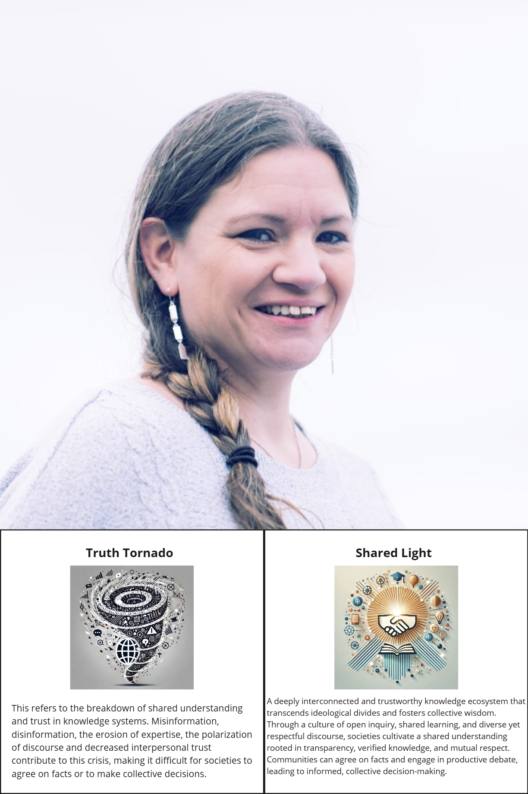
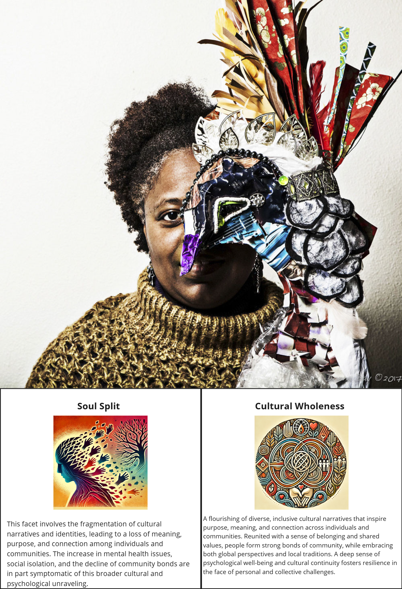
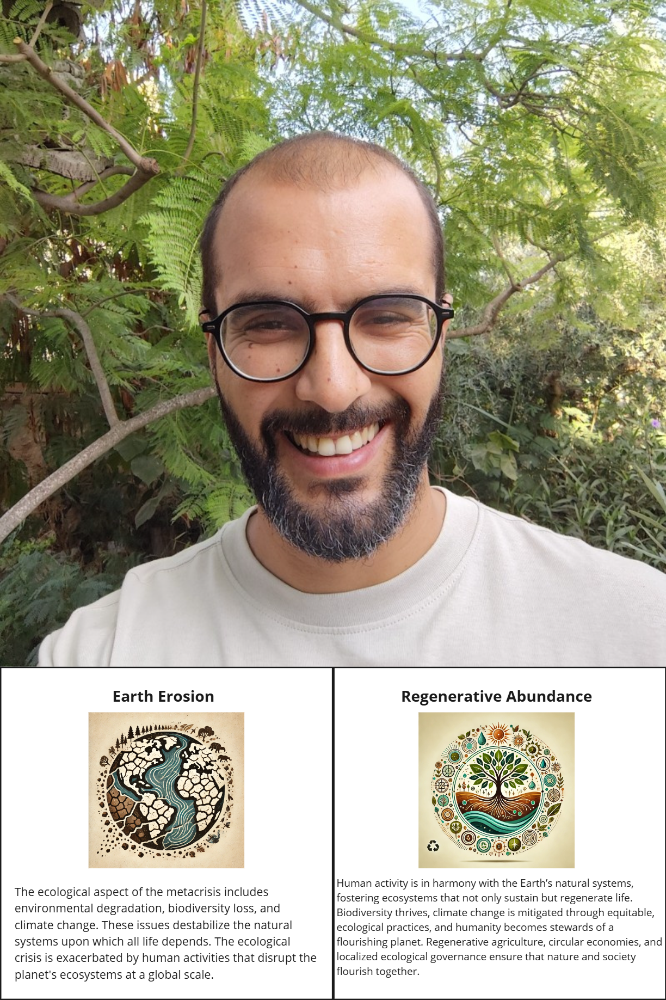
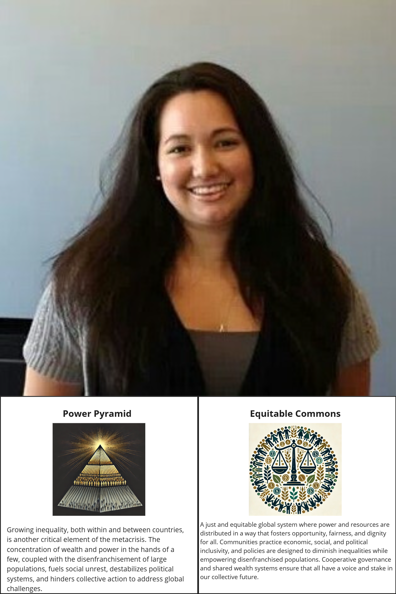
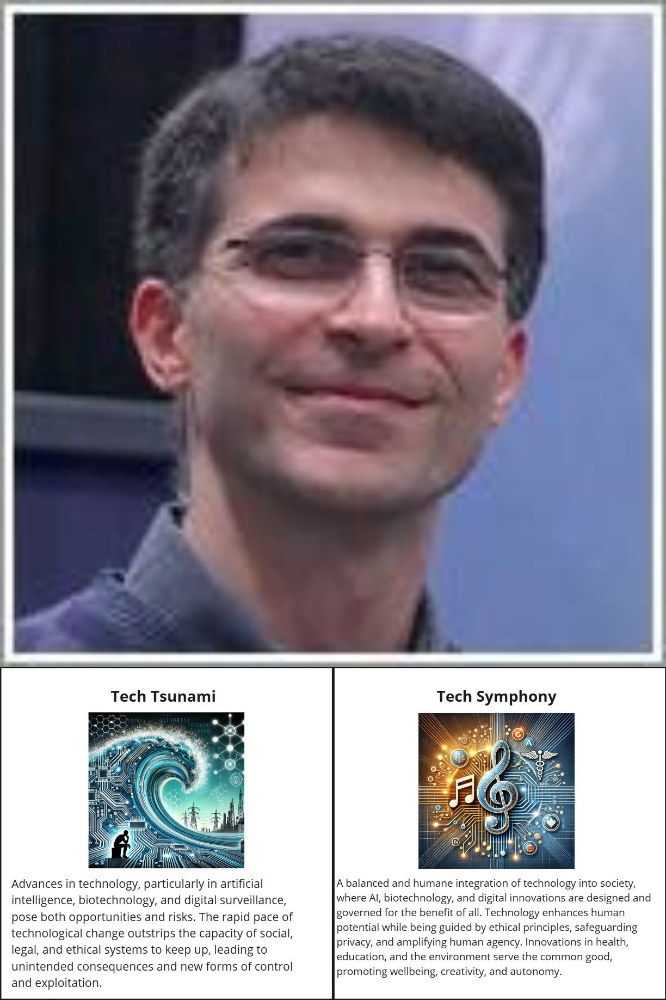
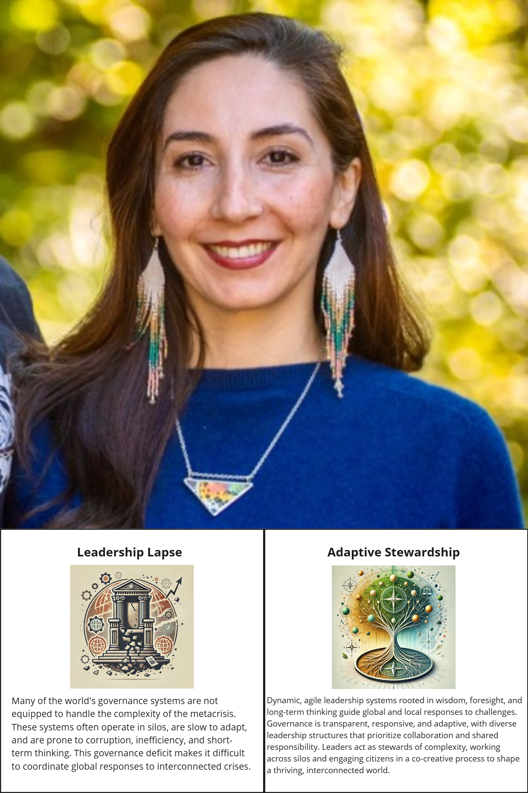

# Domains and Stewards

The term "Metacrisis" points not just to the deep integration between the problems facing our planet, but to them having underlying origins. In the Metachrysalis framework, we look at 8 domains or facets of specific challenge as part of the Metacrisis. We're honoured to have the following stewards working with us to help select community members to participate in a deeper, more intensive process between now and the end of March.

Below, learn a bit more about the stewards and the domains they're focused on.

---

## Ollie Rankin

**Domain Steward:** Extinction Edge → Resilient Renaissance

Ollie Rankin works at the intersection of technology, imagination, and collective responsibility—where humanity’s greatest risks and greatest possibilities meet. A virtual reality pioneer, multidisciplinary artist, and futurist, Ollie has spent decades exploring how emerging technologies shape culture, power, and our shared future.

With a background in computer science, artificial intelligence, and computer graphics, Ollie has helped build some of the world’s most complex digital systems—from large-scale crowd simulations in major film franchises to immersive virtual worlds and global VR events. Alongside this technical work, he has consistently asked deeper questions: What kinds of futures are we building? Who benefits? And how do we ensure technology serves life rather than endangers it?

As Co-Founder and President of United Humans, Ollie focuses on rethinking the “operating systems” of civilization—developing open, participatory approaches to governance, fairness, and collective decision-making grounded in science, ethics, and care. His work spans immersive storytelling, public speaking, activism, and community-building, with a long-standing commitment to inclusion, sustainability, and resisting authoritarianism in all its forms.

As a Metachrysalis Judge, Ollie listens for projects and people who are engaging seriously with existential risk—not from fear or abstraction, but from responsibility and imagination. He is especially drawn to work that helps societies adapt to rapid change, builds resilient systems across technology and ecology, and invites more people into shaping humane, just, and life-affirming futures.

---

## Faizan Abbasi

**Domain Steward:** Fragile Web → Interwoven Harmony

Faizan Abbasi is a systems-minded generalist who works where complexity, uncertainty, and “stuck” problems tend to gather. Rooted in the Global South and shaped by lived experience of volatility and uneven infrastructure, Faizan brings a grounded understanding of how economic, political, technological, and social systems can fail—often not from one big collapse, but from cascading breakdowns across an interconnected web.

Across strategy, emerging technology, and responsible innovation, Faizan’s work focuses on cracking open old assumptions and surfacing fresh patterns—especially in environments where people feel trapped between chaos and inertia. They’ve helped catalyze transformation across diverse industries and communities, with particular attention to the governance and ethical implications of XR, AI, and digital systems that increasingly shape everyday life.

Faizan’s orientation is deeply relational and pragmatic: resilience isn’t a buzzword, it’s what happens when networks are real, trust is earned, and systems are designed to degrade gracefully rather than catastrophically. They’re especially interested in decentralized, cooperative solutions—the kinds that distribute capacity, reduce single points of failure, and help communities adapt when conditions change.

As a Metachrysalis Judge, Faizan listens for changemakers who strengthen the “mesh” of the Fraser Lowland: projects that build redundancy, mutual aid, trustworthy coordination, and cross-domain collaboration—so local disruptions don’t become domino effects, and interdependence becomes a source of shared stability and care.

---

## Kristin Wilson (Kozar)

**Domain Steward:** Truth Tornado → Shared Light

Kristin Wilson (Kozar) is a leader, researcher, and community advocate working at the heart of one of the most important truth-and-trust challenges of our time: how societies repair shared understanding when history has been distorted, records have been withheld, and knowledge systems have been built to exclude.

A proud member of the Hwlitsum First Nation, Kristin served as Executive Director of UBC’s Indian Residential School History and Dialogue Centre, where her work sits at the intersection of truth-telling, record stewardship, and relationship-building. She is currently completing a PhD at UBC iSchool focused on Indigenous Data Sovereignty and the ethical, governance, and justice dimensions of residential school records—work grounded in the principle that Indigenous Peoples have inherent rights to autonomy over their data, stories, and knowledge systems.

Kristin brings deep experience in policy development, strategic partnerships, and community-led program design, including co-leading initiatives like the Oral Testimony Program—designed so that First Nations retain authority over how testimony is held, used, and shared, in alignment with Indigenous protocols and care.

As a Metachrysalis Judge, Kristin listens for changemakers who strengthen the conditions for Shared Light: transparency with integrity, truth with cultural safety, and knowledge practices that build trust across difference. She is especially drawn to work that restores access, protects lived experience from extraction, and creates pathways for collective decision-making rooted in accountability, respect, and repair.

---

## Beverly Aarons

**Domain Steward:** Soul Split → Cultural Wholeness

Beverly Aarons is a Narrative Architect, Cultural Strategist, multidisciplinary storyteller and community-builder who works with one of the most underappreciated levers for collective resilience: **meaning**. As a writer, artist, and game + interactive media developer, Beverly creates spaces where people can feel what’s happening beneath the headlines—where history, present-day realities, and imagined futures can be held together without flattening complexity.

Her work consistently brings forward perspectives that are often unseen, and she aims to infuse creative practice with emotional depth, cultural texture, and human truth. Beverly has received multiple awards, fellowships, and grants for projects that blend art, community engagement, and participatory design—including live events and interactive experiences that invite people to grapple together with questions like economic futures, migration, climate disruption, and what it means to belong.

Alongside her creative practice, Beverly has spent years building real-world community infrastructure—most notably as the founder of the Seattle French Conversation Group, which grew into a thriving network of thousands of people meeting regularly for connection, culture, and shared practice. She also publishes Artists Up Close, a longform newsletter devoted to intimate profiles that go deeper than sound bites—documenting what artists make, why they make it, and how creativity sustains a life.

As a Metachrysalis Judge, Beverly listens for projects and people who mend the “soul split” not through slogans, but through **story, ritual, play, and relationship**—work that rebuilds belonging, strengthens community bonds, and helps diverse people recover purpose, continuity, and cultural wholeness in the places they call home.

Beverly Aarons is a multidisciplinary storyteller and community-builder who works with one of the most underappreciated levers for collective resilience: meaning. As a writer, artist, and game + interactive media developer, Beverly creates spaces where people can feel what’s happening beneath the headlines—where history, present-day realities, and imagined futures can be held together without flattening complexity.

Her work consistently brings forward perspectives that are often unseen, and she aims to infuse creative practice with emotional depth, cultural texture, and human truth. Beverly has received multiple awards, fellowships, and grants for projects that blend art, community engagement, and participatory design—including live events and interactive experiences that invite people to grapple together with questions like economic futures, migration, climate disruption, and what it means to belong.

Alongside her creative practice, Beverly has spent years building real-world community infrastructure—most notably as the founder of the Seattle French Conversation Group, which grew into a thriving network of thousands of people meeting regularly for connection, culture, and shared practice. She also publishes Artists Up Close, a longform newsletter devoted to intimate profiles that go deeper than sound bites—documenting what artists make, why they make it, and how creativity sustains a life.

As a Metachrysalis Judge, Beverly listens for projects and people who mend the “soul split” not through slogans, but through story, ritual, play, and relationship—work that rebuilds belonging, strengthens community bonds, and helps diverse people recover purpose, continuity, and cultural wholeness in the places they call home.

---

## Elyes Mkacher

**Domain Steward:** Earth Erosion → Regenerative Abundance

Elyes Mkacher is a regenerative farmer, permaculture designer, educator, and community tender whose work is rooted in the lived realities of land, water, and place. Based in Tunisia, Elyes has spent more than a decade working at local, bioregional, and global scales to restore degraded ecosystems while reweaving the social, cultural, and economic relationships that make regeneration possible.

As the founder of Dar Emmima, a permaculture education and research ecosystem, Elyes has helped train and support hundreds of practitioners through immersive, place-based learning. His approach to regeneration goes far beyond technical fixes: it integrates ecology with right livelihood, commoning, bioregional organizing, and decolonizing imagination—treating landscapes and communities as living systems that must be healed together.

Elyes is also deeply involved with the Design School for Regenerating Earth, where he helps steward a global community of practice connecting people across bioregions who are responding to ecological collapse with grounded action and long-term care. Whether designing food forests, teaching permaculture ethics, or guiding bioregional pilgrimages, his work emphasizes humility, observation, and alignment with nature’s patterns.

As a Metachrysalis Judge, Elyes listens for projects that move beyond extraction and mitigation toward true regenerative abundance—work that restores biodiversity, strengthens local ecological governance, and helps communities become capable stewards of the living systems that sustain them.

---

## Jessi Maness

**Domain Steward:** Power Pyramid → Equitable Commons

Jessi Maness is a crisis-response leader and nonprofit executive whose work is grounded in a simple but demanding question: who actually gets help, power, and voice when systems are under strain? As Executive Director of Resilience Relief & Recovery Reach (R4), Jessi has been deeply involved in coordinating disaster relief, logistics, and long-term recovery efforts—most notably in Western North Carolina following Hurricane Helene.

With a background spanning finance, operations, design, and project management, Jessi brings a rare combination of on-the-ground pragmatism and systems-level thinking. She has helped build and steward tools like R4D2 (Resilience Relief & Recovery Reach – Disaster Dash), which connects donors, volunteers, and supply sites to ensure resources move quickly and equitably to where they’re needed most. Her work consistently centers collaboration with grassroots groups, mutual aid networks, and community leaders—reducing bottlenecks, avoiding duplication, and resisting top-down control in moments when centralized power often fails people most.

Jessi understands inequality not as an abstract problem, but as something that shows up in logistics, access, information flow, and whose needs are taken seriously during crises. Her approach emphasizes shared infrastructure, cooperative governance, and dignity-first response, ensuring communities aren’t just recipients of aid, but active participants in shaping recovery.

As a Metachrysalis Judge, Jessi listens for projects that redistribute capacity and agency—work that strengthens commons-based systems, empowers disenfranchised people, and transforms relief and recovery into pathways toward lasting equity, resilience, and shared ownership of our collective future.

---

## Saeed Dyanatkar

**Domain Steward:** Tech Tsunami → Tech Symphony

Saeed Dyanatkar is a long-time leader at the intersection of technology, education, and human-centered innovation. Based in Vancouver, Saeed leads UBC Studios, the Emerging Media Lab, and the Digital Experience Lab under the Office of the CIO at the University of British Columbia, where his work focuses on responsibly integrating emerging technologies—AI, immersive media, and digital platforms—into teaching, learning, and knowledge translation.

With a background in systems design and digital media, Saeed has spent nearly two decades building environments where experimentation is encouraged, failure is treated as a teacher, and technology is always in service to human purpose rather than novelty or control. Under his leadership, UBC’s Emerging Media Lab has become a trusted space for faculty, staff, and students to explore how new tools can enhance education, research impact, accessibility, and public understanding—earning multiple awards for collaborative excellence along the way.

Saeed brings a deeply ethical orientation to technological change. He is attentive to questions of power, surveillance, labor, and unintended consequences, and consistently emphasizes governance, care, and institutional responsibility when deploying new technologies at scale. His work demonstrates that innovation can be both ambitious and humane—creative without being extractive.

As a Metachrysalis Judge, Saeed listens for projects that help turn the Tech Tsunami into a Tech Symphony: initiatives that align innovation with public good, protect human agency and privacy, and use technology to expand learning, wellbeing, creativity, and collective capacity—especially in ways that institutions and communities can sustain over time.

---

## Soudeh Jamshidian

**Domain Steward:** Leadership Lapse → Adaptive Stewardship

Soudeh Jamshidian, PhD, is a governance scholar, educator, and systems steward working at the intersection of Indigenous-led conservation, ethical governance, and adaptive leadership. Her work addresses one of the core failures of our time: institutions that are structurally ill-equipped to respond to complexity, interdependence, and long-term responsibility.

Soudeh brings deep experience in designing and supporting governance systems that move beyond siloed decision-making and extractive leadership models. Through her leadership roles with organizations such as the Human Data Commons Foundation and IISAAK OLAM Foundation, and her collaborations with the Conservation through Reconciliation Partnership, she has helped advance frameworks for Indigenous Protected and Conserved Areas (IPCAs), ethical space, and reconciliation-centered stewardship. Her work consistently emphasizes legitimacy, transparency, and shared responsibility—especially where governance meets land, data, and community authority.

As an educator at institutions including Vancouver Island University, UBC, and Simon Fraser University, Soudeh supports the next generation of leaders in navigating complex governance environments that braid Indigenous and Western systems without collapsing one into the other. She is deeply committed to capacity-building: not just training leaders, but cultivating the conditions in which adaptive, relational, and accountable leadership can emerge and endure.

As a Metachrysalis Judge, Soudeh listens for projects and people who embody Adaptive Stewardship—work that strengthens governance from the ground up, practices power-sharing with integrity, and treats leadership as an ongoing responsibility to people, place, and future generations rather than a position of control.

