# Changemaker Classes
*Image, title, and description for core changemaker roles.*

---

## Roles
| Image | Title | Tagline | Text |
|---|---|---|---|
| 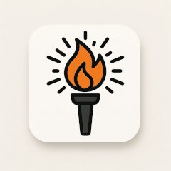 | Initiator | You're the spark. | You start things. You act when others are still thinking. You're good at sensing what needs to happen and taking the first step, even when the path is not clear yet. You often rally people before there is a plan. |
| 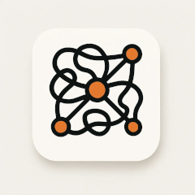 | Synthesizer | You make sense of the mess. | You connect dots others do not see. You hold multiple perspectives and help make things coherent. When people talk past each other, you find the throughline. When there is chaos, you find structure. |
| 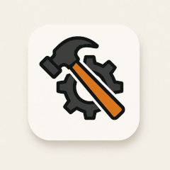 | Implementer | You get it done. | You turn ideas into action. You build, fix, move, execute. You like clear roles, working parts, and visible progress. You are happiest when a project goes from plan to reality and you helped make it happen. |
| 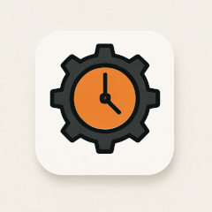 | Sustainer | You keep things running. | You are the quiet backbone of teams and systems. You hold routines, check in, and keep people and projects from falling through the cracks. You think long-term and tend what others forget. |
| 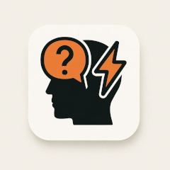 | Strategic Challenger | You name the tension. | You are willing to question what others avoid. You notice blind spots, power dynamics, and flawed assumptions. You push for truth, clarity, and change because you care. |
| 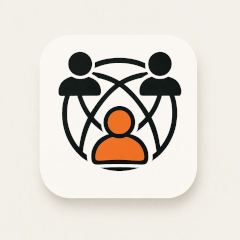 | Relational Weaver | You build the web. | You know who is connected to whom, and who should be. You build trust, hold relationships, and keep the social fabric strong. You make space for care, inclusion, and collaboration. |
| 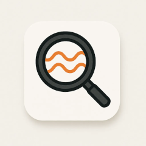 | Pattern Tracker | You see the deeper currents. | You zoom out. You notice patterns over time, across systems, and under the surface. You help others see root causes, not just symptoms, and often warn of risks before they arrive. |
|  | Meaning Maker | You make it matter. | You create clarity, resonance, and shared purpose. You use story, ritual, metaphor, or reflection to help people connect. You bring the why into the what. Without you, things feel flat or transactional. |
| 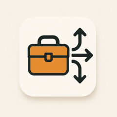 | Resource Mobilizer | You make things possible. | You know how to find what is needed: funds, tools, talent, and space. You move resources where they have the most impact. You are pragmatic, creative, and often the person who knows a person. |
| 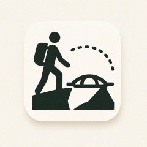 | Edgewalker | You live at the frontier. | You explore new ways of thinking, creating, and organizing. You often live between worlds, bridging cultures, disciplines, or paradigms. You stretch what is possible and bring back insights others might miss. |
| 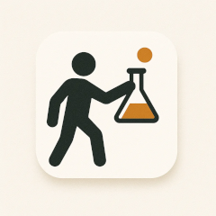 | Experimenter | You test things. | You prototype, iterate, and learn in motion. You thrive in uncertainty and enjoy learning by doing. You help groups evolve quickly and avoid perfection paralysis. |
| 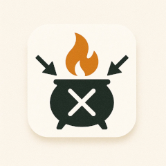 | Conflict Alchemist | You work with tension. | You do not just mediate, you transform. You help groups face hard things, shift stuck patterns, and emerge stronger. You move toward conflict, not away from it. |
| 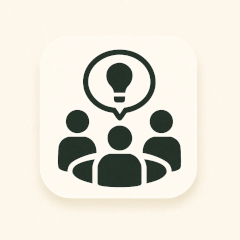 | Sensemaker / Educator | You help people understand. | You distill complexity. You turn big ideas into understandable guidance. You train, teach, or translate. |
| 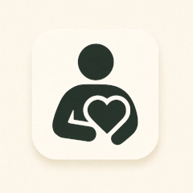 | Caregiver / Nourisher | You tend what others depend on. | You tend people and the unseen. You notice what needs warmth, rest, or support, and you bring it. You create safety for others to grow, act, or speak. |
| 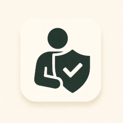 | Guardian / Steward / Protector | You hold the line. | You watch the edges. You hold ethical boundaries, protect the vulnerable, and help groups stay aligned with values, place, and purpose. |
| 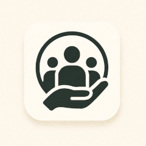 | Welcomer | You grow the circle. | You notice who is not here yet and you reach out. You welcome people into the space, meet them where they are, and help them find their place in the work. You make complexity feel less intimidating and community feel more human. |

---

## Continue
- **[Character Pitfalls](/pages/framework-character-pitfalls/)**
- **[Framework Library](/pages/frameworks/)**
- **[How to Play](/pages/play/)**