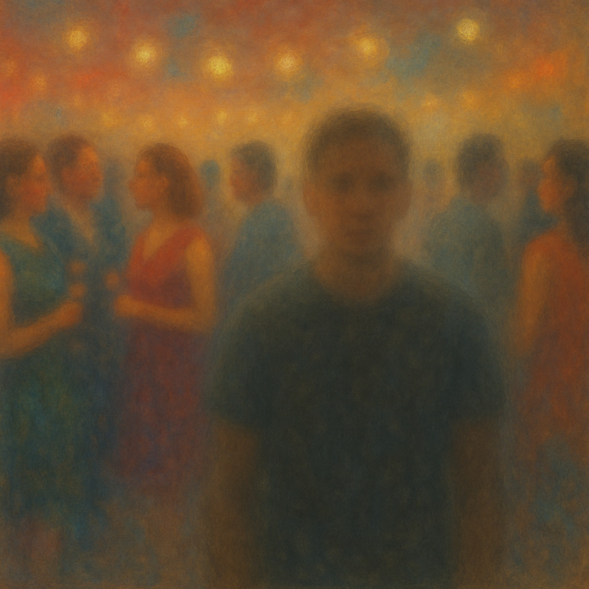
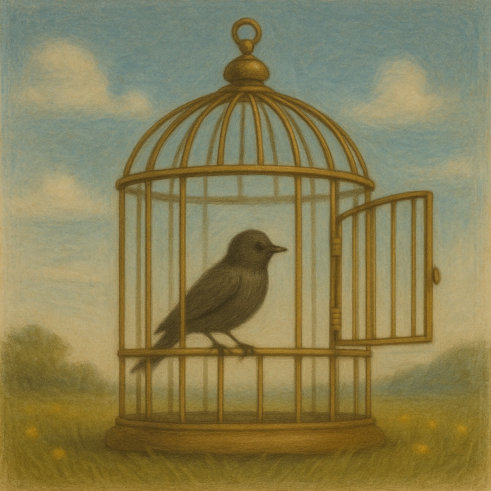
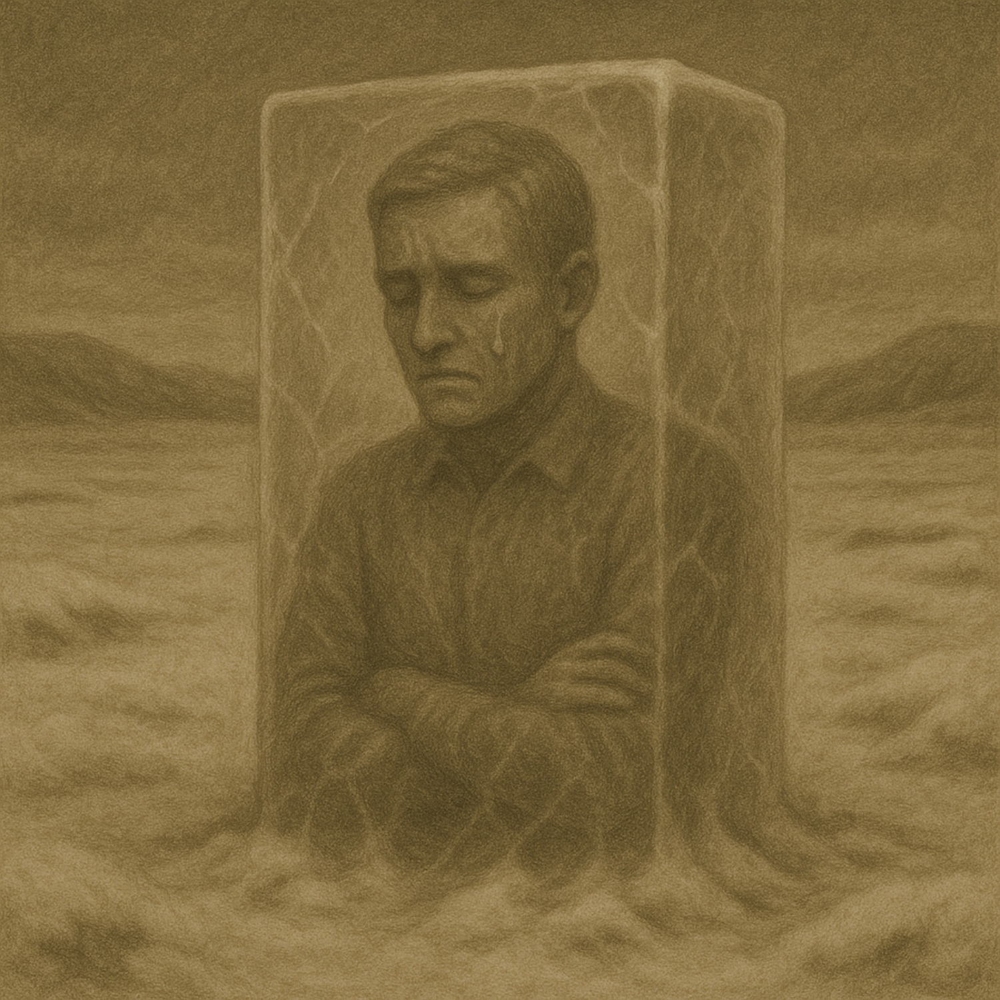
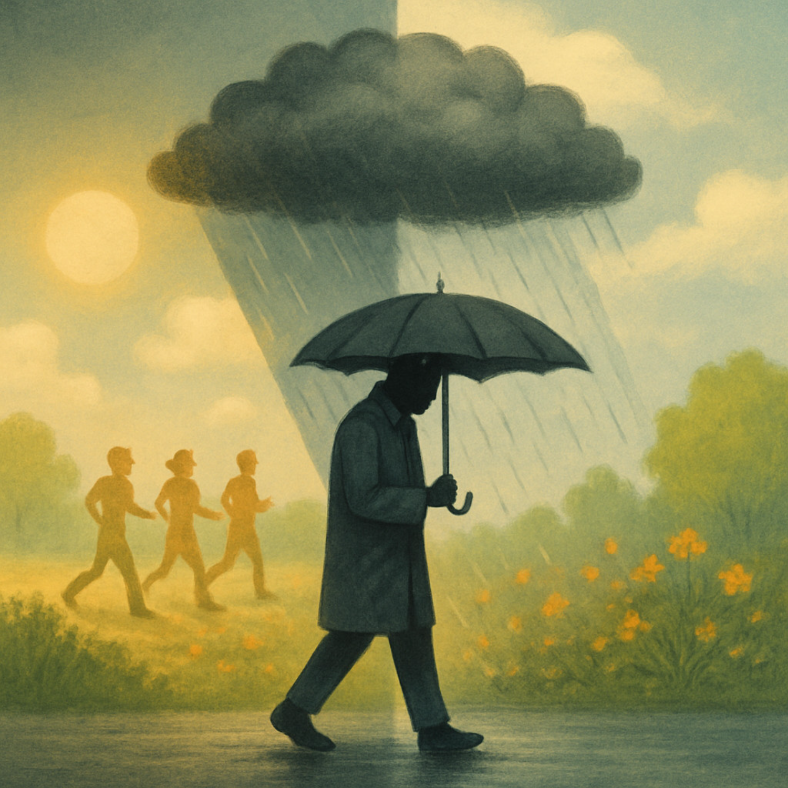
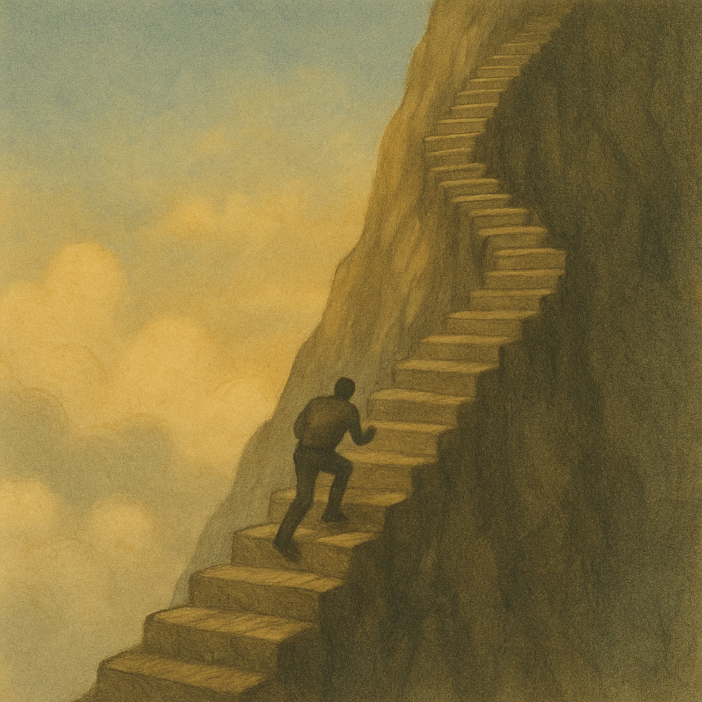
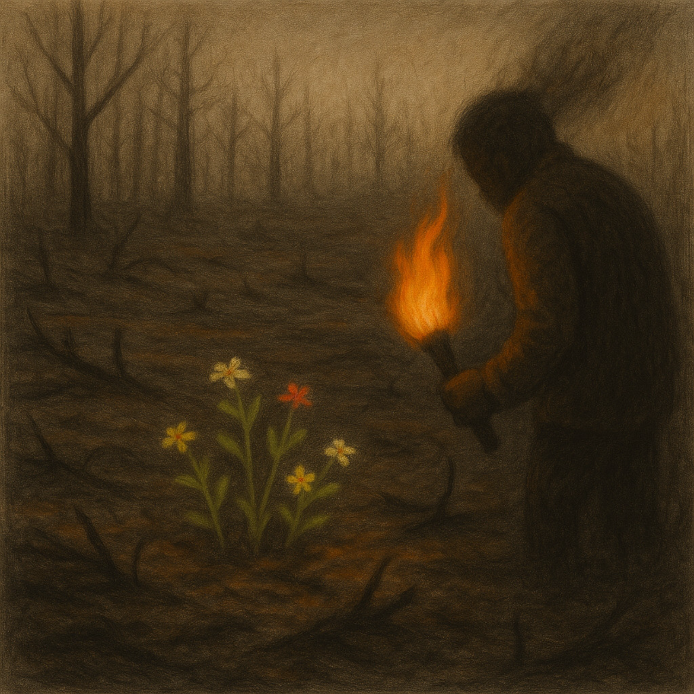
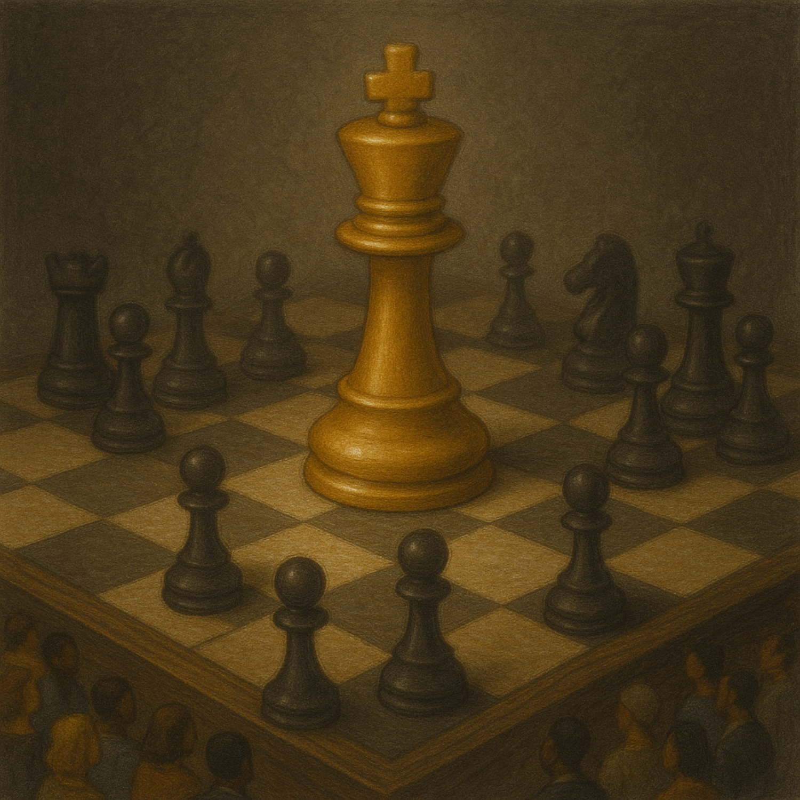
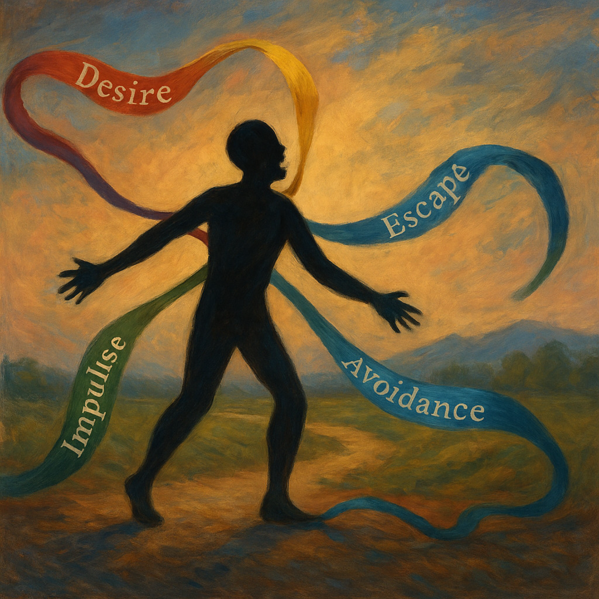

# Character Pitfalls
*Maladaptive schemas that can distort changemaker behavior.*

---

## Maladaptive Schemas
| Image | Title | Text |
|---|---|---|
|  | Emotional Deprivation | The belief and expectation that your primary needs will never be met. The sense that no one will nurture, care for, guide, protect, or empathize with you. |
|  | Abandonment | The belief and expectation that others will leave, that others are unreliable, that relationships are fragile, that loss is inevitable, and that you will ultimately wind up alone. |
|  | Mistrust / Abuse | The belief that others are abusive, manipulative, selfish, or looking to hurt or use you. Others are not to be trusted. |
|  | Defectiveness | The belief that you are flawed, damaged, or unlovable, and you will thereby be rejected. |
|  | Social Isolation | The pervasive sense of aloneness, coupled with a feeling of alienation. |
|  | Vulnerability | The sense that the world is a dangerous place, that disaster can happen at any time, and that you will be overwhelmed by the challenges that lie ahead. |
|  | Dependence / Incompetence | The belief that you are unable to effectively make your own decisions, that your judgment is questionable, and that you need to rely on others to help get you through day-to-day responsibilities. |
|  | Emotional Enmeshment / Undeveloped Self | The sense that you do not have an identity or individuated self that is separate from one or more significant others. |
|  | Failure | The expectation that you will fail, or belief that you cannot perform well enough. |
|  | Subjugation | The belief that you must submit to the control of others, or else punishment or rejection will be forthcoming. |
|  | Self-Sacrifice | The belief that you should voluntarily give up your own needs for the sake of others, usually to an excessive point. |
|  | Approval-Seeking / Recognition-Seeking | The sense that approval, attention, and recognition are far more important than genuine self-expression and being true to oneself. |
|  | Emotional Inhibition | The belief that you must control your self-expression or others will reject or criticize you. |
|  | Negativity / Pessimism | The pervasive belief that the negative aspects of life outweigh the positive, along with negative expectations for the future. |
|  | Unrelenting Standards | The belief that you need to be the best, always striving for perfection or to avoid mistakes. |
|  | Punitiveness | The belief that people should be harshly punished for their mistakes or shortcomings. |
|  | Entitlement / Grandiosity | The sense that you are special or more important than others, and that you do not have to follow the rules like other people even if this harms others. It can also show up as exaggerated superiority for power or control. |
|  | Insufficient Self-Control / Self-Discipline | The sense that you cannot accomplish your goals, especially if the process contains boring, repetitive, or frustrating aspects, and that you cannot resist impulses that lead to detrimental results. |

---

## Continue
- **[Permaculture Capitals](/pages/framework-permaculture-capitals/)**
- **[Framework Library](/pages/frameworks/)**
- **[How to Play](/pages/play/)**