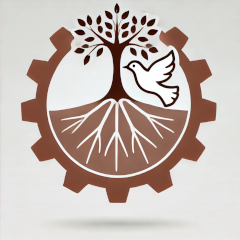
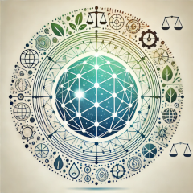
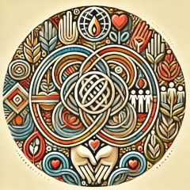
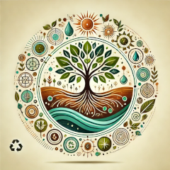
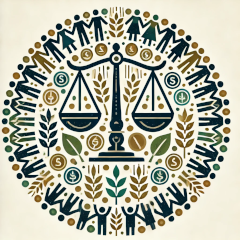
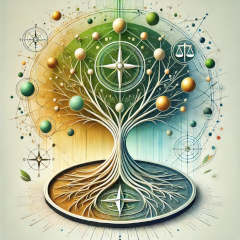

# The 8 Facets of the Metachrysalis
*Paired possibilities for collective flourishing.*

---

## Facets
| Image | Title | Text |
|---|---|---|
|  | Resilient Renaissance | Humanity's future is safeguarded by robust, adaptive systems that absorb shocks from technological advances, environmental change, and political tension. Through collaboration across science, ethics, and governance, we build responsible innovation, sustainable ecosystems, and peace-building for long-term flourishing. |
|  | Interwoven Harmony | A resilient global network of economic, political, environmental, and technological systems where interdependencies foster cooperation, mutual support, and adaptability. Local disruptions are mitigated and cascading failures are prevented by decentralized solutions and agile governance. |
|  | Shared Light | A trustworthy knowledge ecosystem that transcends ideological divides and fosters collective wisdom. Open inquiry, shared learning, transparency, and respectful discourse support shared understanding, productive debate, and informed collective decision-making. |
|  | Cultural Wholeness | Diverse, inclusive cultural narratives inspire purpose, meaning, and connection. People recover belonging and shared values while embracing both global perspectives and local traditions, strengthening psychological wellbeing and cultural continuity. |
|  | Regenerative Abundance | Human activity aligns with Earth's natural systems so ecosystems are not only sustained but regenerated. Biodiversity recovers, climate impacts are reduced through equitable ecological practice, and circular, place-based economies help nature and society flourish together. |
|  | Equitable Commons | A just system where power and resources are distributed to foster fairness, dignity, and opportunity for all. Inclusive policy and cooperative governance reduce inequality and empower historically disenfranchised communities. |
|  | Tech Symphony | Humane integration of technology where AI, biotechnology, and digital systems are designed and governed for the common good. Ethical design protects privacy, strengthens agency, and advances health, learning, and ecological wellbeing. |
|  | Adaptive Stewardship | Agile leadership rooted in wisdom, foresight, and long-term thinking. Governance is transparent, responsive, and collaborative, with diverse leaders who engage citizens in co-creating a thriving, interconnected future. |

---

## Continue
- **[Framework Library](/pages/frameworks/)**
- **[How to Play](/pages/play/)**
- **[Start Here](/pages/start-here/)**