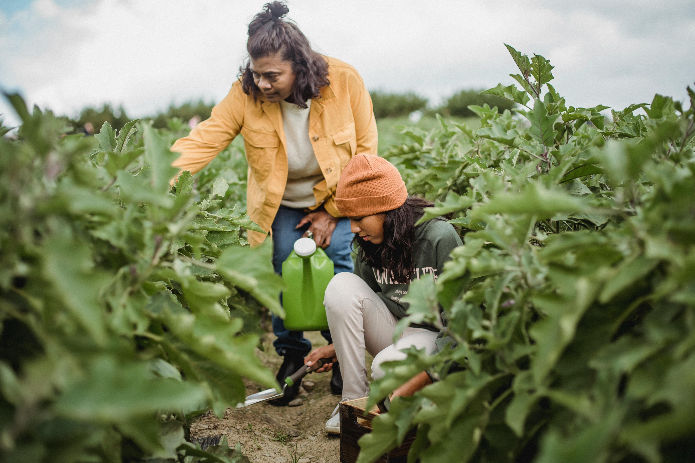
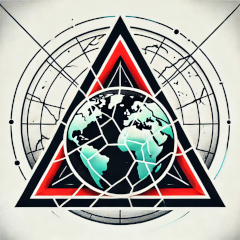
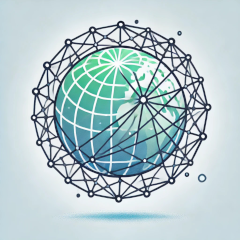
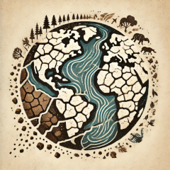
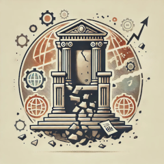

# The 8 Facets of the Metacrisis
*Where breakdown patterns are concentrated.*

---

## Facets
| Image | Title | Text |
|---|---|---|
|  | Extinction Edge | Threats that could lead to human extinction or permanently curtail humanity's potential. Examples include nuclear war, unchecked artificial intelligence, and catastrophic climate change. Risks are amplified by interconnections between technology, environment, and global politics. |
|  | Fragile Web | Inherent vulnerabilities in global economic, political, environmental, and technological systems. As systems become more interconnected, they become more susceptible to cascading failures where disruption in one area can trigger crises across many domains. |
|  | Truth Tornado | Breakdown of shared understanding and trust in knowledge systems. Misinformation, disinformation, erosion of expertise, and polarized discourse make it difficult to agree on facts or make collective decisions. |
|  | Soul Split | Fragmentation of cultural narratives and identities, leading to loss of meaning, purpose, and connection. Rising mental health strain, social isolation, and weakening community bonds are symptoms of this unraveling. |
|  | Earth Erosion | Environmental degradation, biodiversity loss, and climate change destabilize the natural systems on which life depends. Human activities disrupt ecosystems at planetary scale. |
|  | Power Pyramid | Growing inequality within and between countries. Concentration of wealth and power, combined with disenfranchisement, fuels unrest, destabilizes politics, and blocks collective action. |
|  | Tech Tsunami | Rapid advances in AI, biotech, and digital surveillance create both opportunity and danger. Technological change outpaces social, legal, and ethical adaptation, producing unintended consequences and new forms of control. |
|  | Leadership Lapse | Governance systems often cannot handle the complexity of the metacrisis. They are siloed, slow to adapt, and prone to corruption, inefficiency, and short-term thinking, making coordinated response difficult. |

---

## Continue
- **[Metachrysalis Facets](/pages/framework-metachrysalis-facets/)**
- **[Framework Library](/pages/frameworks/)**
- **[Projects](/pages/projects/)**