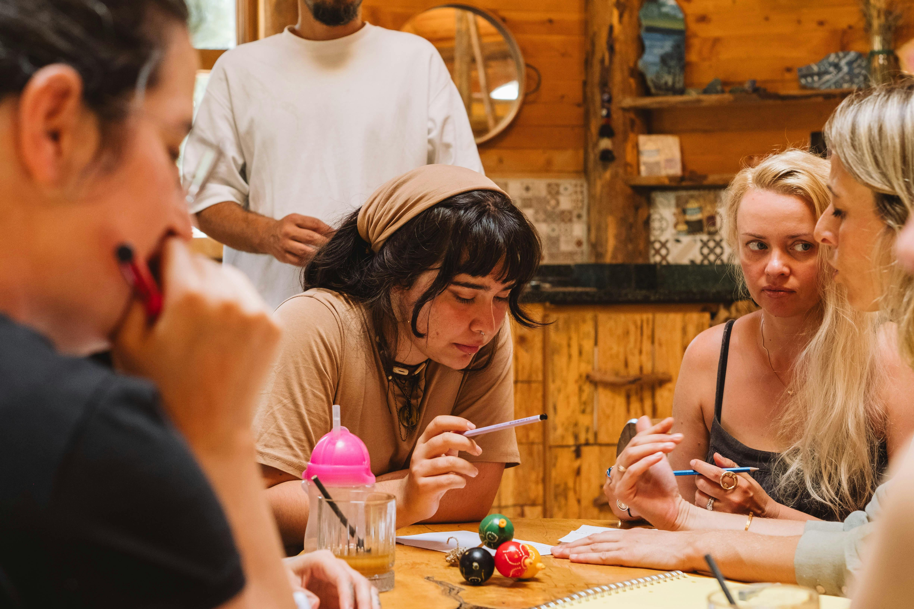
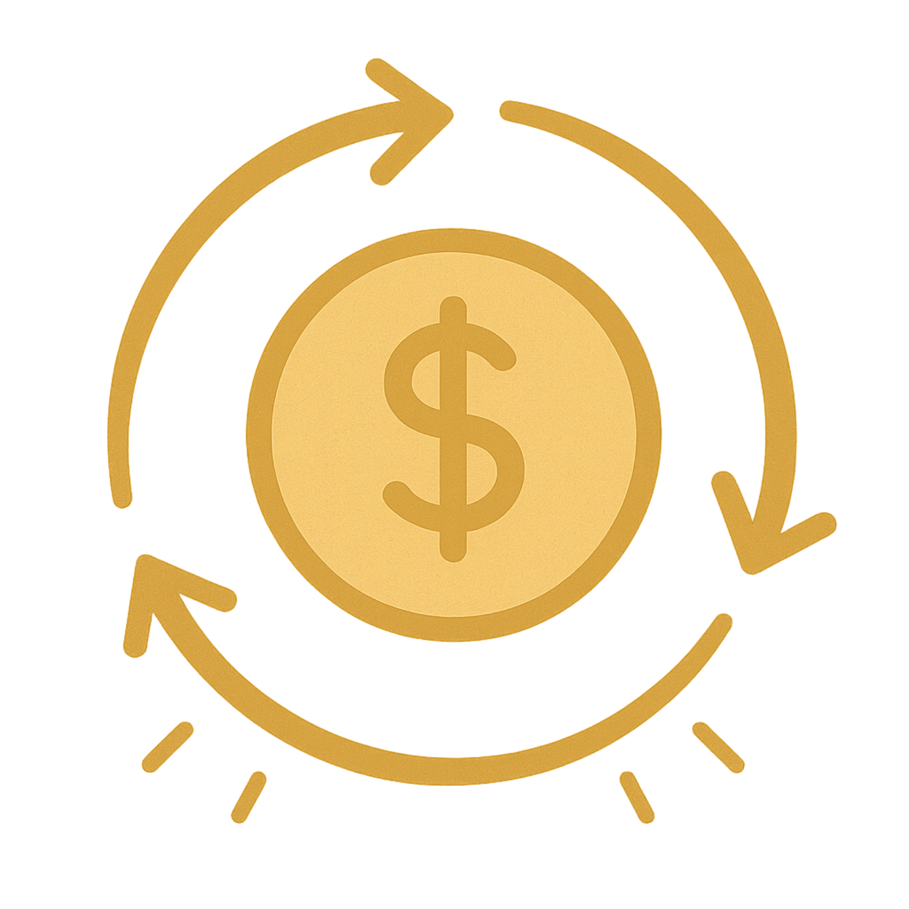
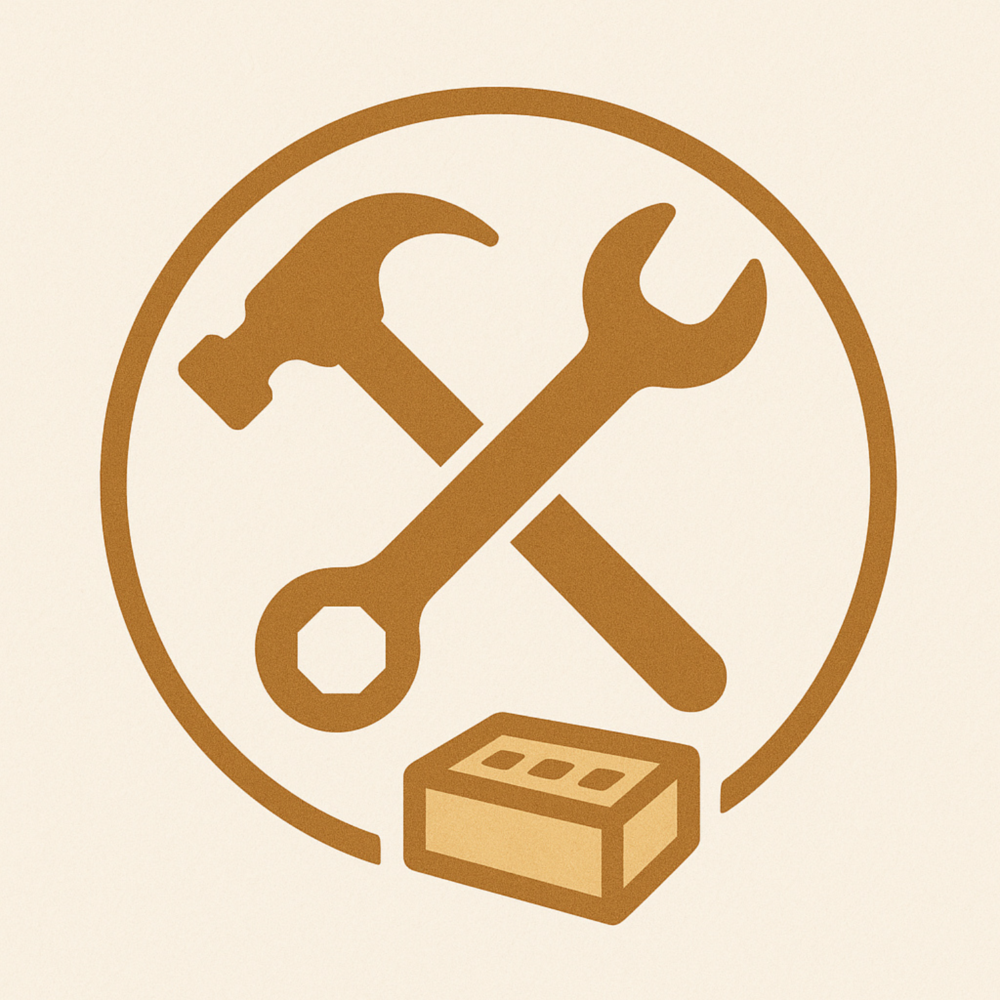
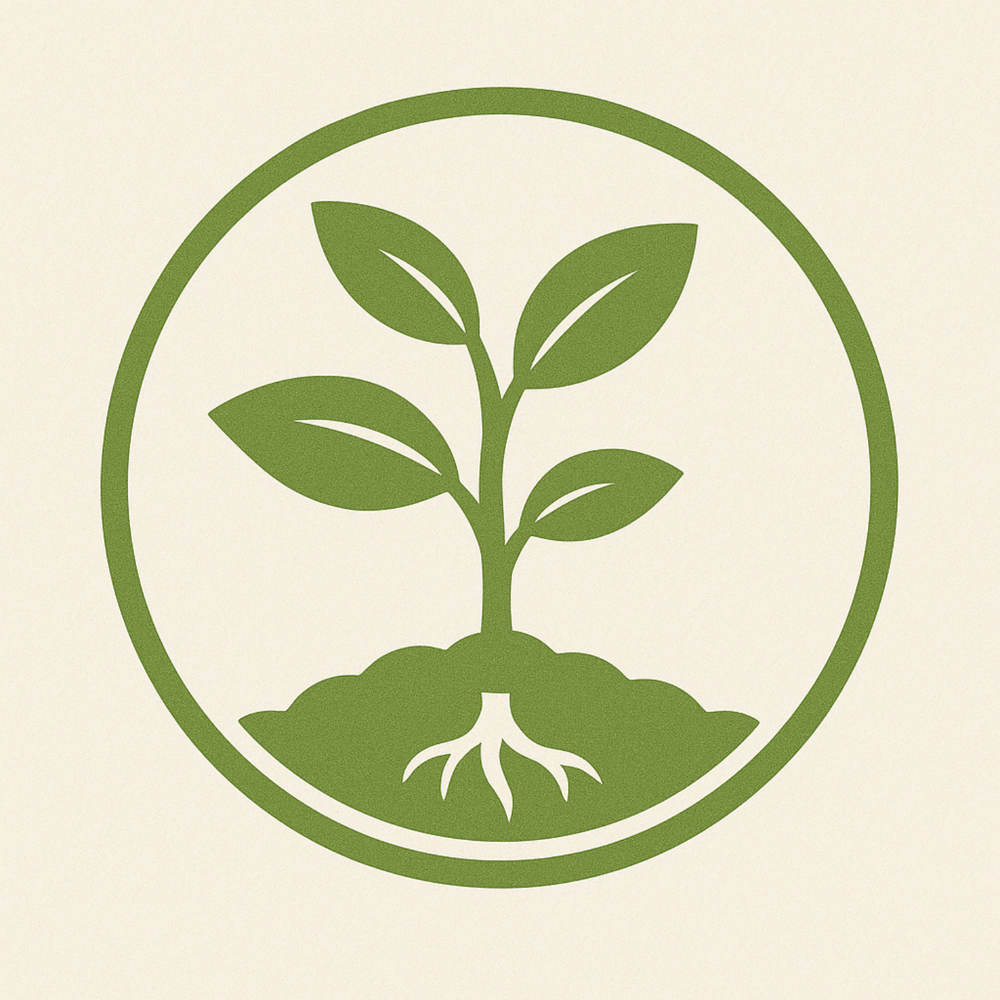
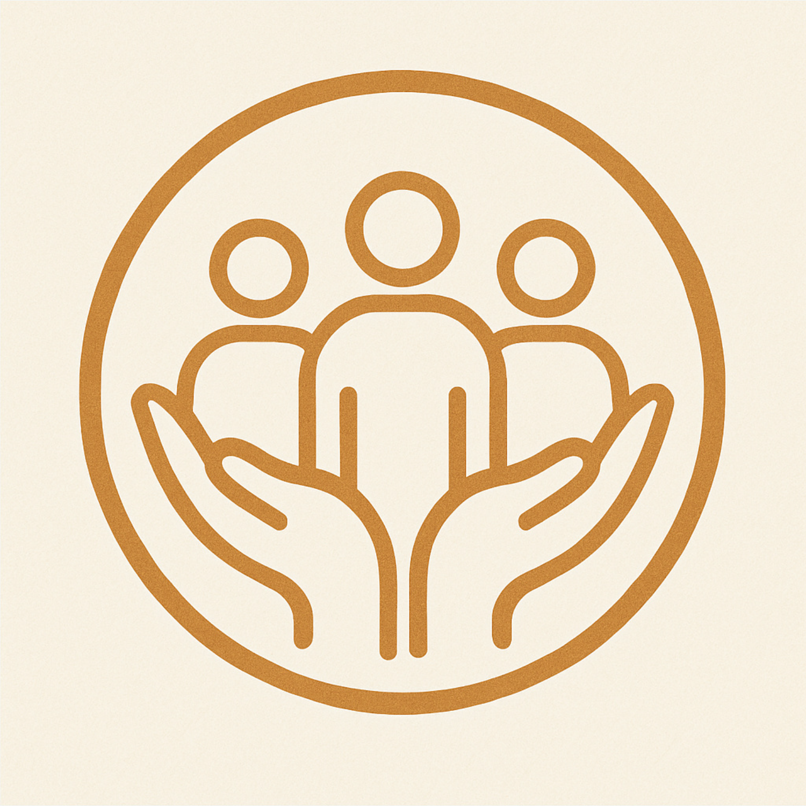
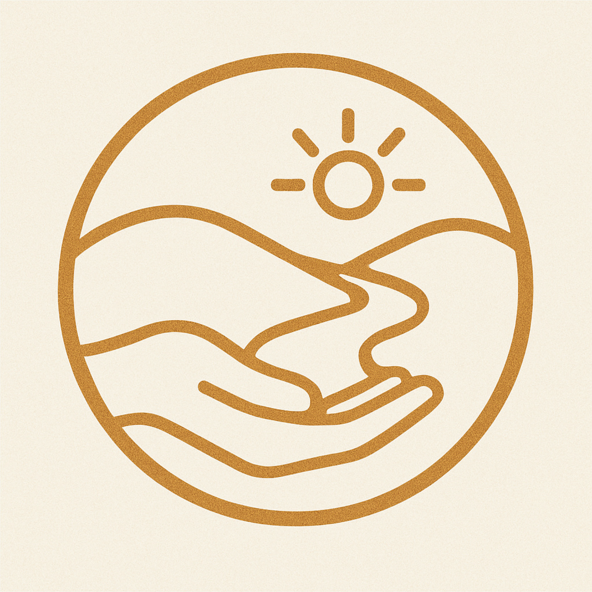
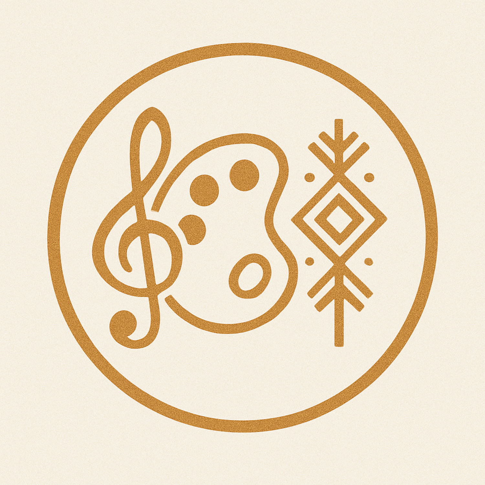
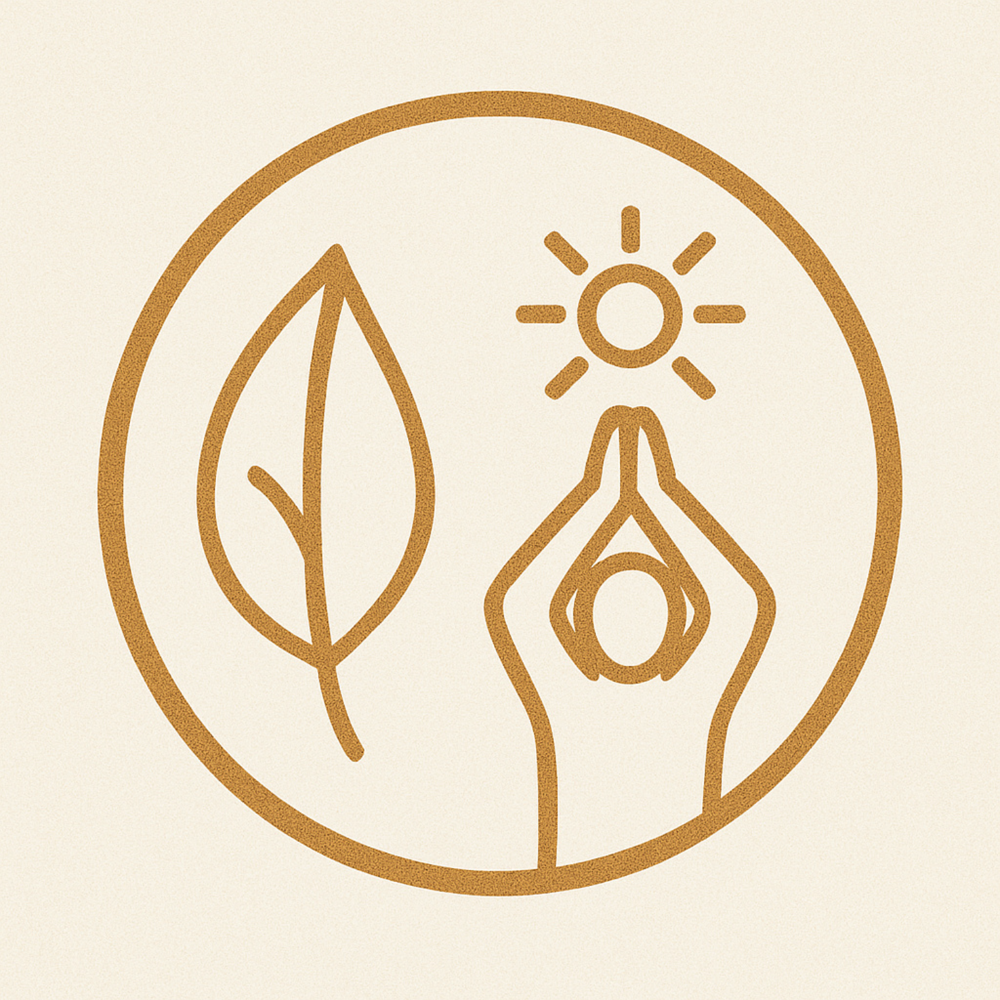

# The 8 Permaculture Capitals
*Multiple forms of value, not only money.*

---

## Capitals
| Image | Title | Text |
|---|---|---|
|  | Financial | Money, currencies, credit, investments, and tokens of exchange value. |
|  | Material | The tangible, human-made or harvested objects: buildings, tools, vehicles, infrastructure, renewable tech, local goods, fiber, fuel. |
|  | Natural | The living and non-living systems of the bioregion: forests, rivers, soil, air, minerals, biodiversity, climate, fungi, wetlands. |
|  | Social | Relationships, trust, networks, cooperation, shared norms, and mutual aid. |
|  | Intellectual | Knowledge, systems thinking, know-how, design methods, data, patterns, and models. |
|  | Experiential | Embodied practice, lessons learned, skillsets earned through time and doing, often tacit or locally specific. |
|  | Cultural | Art, language, shared symbols, heritage, traditions, rituals, values, and aesthetic ways of being. |
|  | Spiritual | Meaning-making, connection to the sacred, inner transformation, purpose, awe, and alignment with something greater. |

---

## Continue
- **[Metacrisis Facets](/pages/framework-metacrisis-facets/)**
- **[Framework Library](/pages/frameworks/)**
- **[Projects](/pages/projects/)**