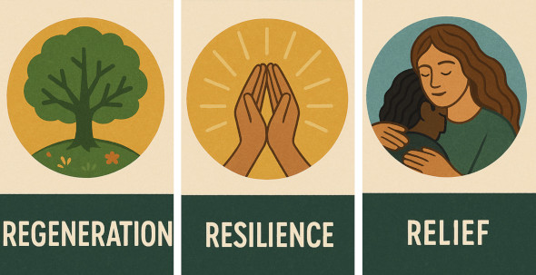

# How to Play
*Turn shared purpose into coordinated action.*

---

## The Core Loop
Metachrysalis is played through a simple loop:

1. Find your place in a bioregion.
2. Clarify your changemaker role.
3. Form or join a small party.
4. Choose one focus thread.
5. Make a real-world Move.
6. Share what you learned.

---

## Three Modes of Play
Most groups move between these modes over time:

- **Relief**: rapid response when systems are under strain.
- **Resilience**: strengthening local capacity between shocks.
- **Regeneration**: long-term redesign of culture, ecology, and economy.

---

## Character, Party, Move
- **Character**: your evolving profile as a changemaker.
- **Party**: your small coordination group (often 3-5 people).
- **Move**: a concrete, finishable real-world action.

The game is cooperative, place-based, and open-source.

---

## Build With the Framework
Use the framework elements to choose your lens and direction:

- **[Framework Library](/pages/frameworks/)**
- **[Changemaker Classes](/pages/framework-changemaker-classes/)**
- **[Character Pitfalls](/pages/framework-character-pitfalls/)**
- **[Permaculture Capitals](/pages/framework-permaculture-capitals/)**
- **[Metacrisis Facets](/pages/framework-metacrisis-facets/)**
- **[Metachrysalis Facets](/pages/framework-metachrysalis-facets/)**

---

## Start Playing
- **[Start Here](/pages/start-here/)**
- **[People](/pages/people/)**
- **[Communities](/pages/communities/)**
- **[Projects](/pages/projects/)**

Play small, stay relational, and iterate in public.